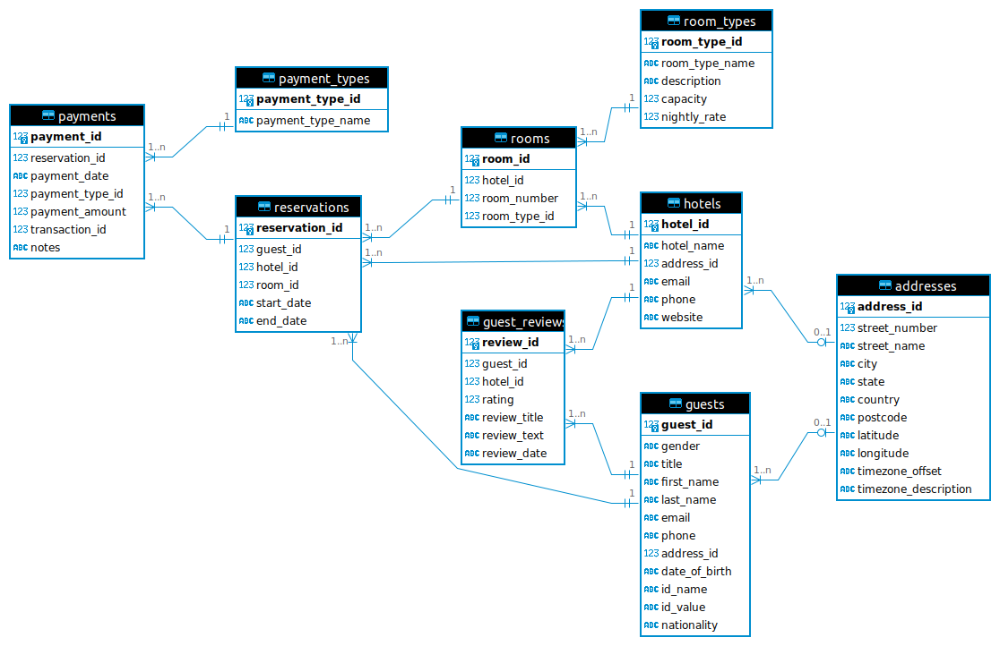

# Installation

```bash
git clone https://github.com/otuva/cse204
cd cse204
python3 -m venv venv
source venv/bin/activate
pip -r requirements.txt
```

# Usage

```
usage: main.py [-h] [--create-unnormalized {5,30,50}] [--create-database] [--insert-database] [--normalize-tables] [--create-view]

Process random user data with database options.

options:
  -h, --help            show this help message and exit
  --create-unnormalized {5,30,50}
                        Create an unnormalized table to store the raw JSON data into csv files
  --create-database     Create normalized database tables to store the data
  --insert-database     Fetch data and insert into the database
  --normalize-tables    Normalize tables to 3NF
  --create-view         Create a database view (define the view logic separately)
```

# Steps

```bash
python main.py --create-unnormalized 50
python main.py --create-database
python main.py --insert-database
python main.py --normalize-tables
python main.py --create-view
```

# Diagram


